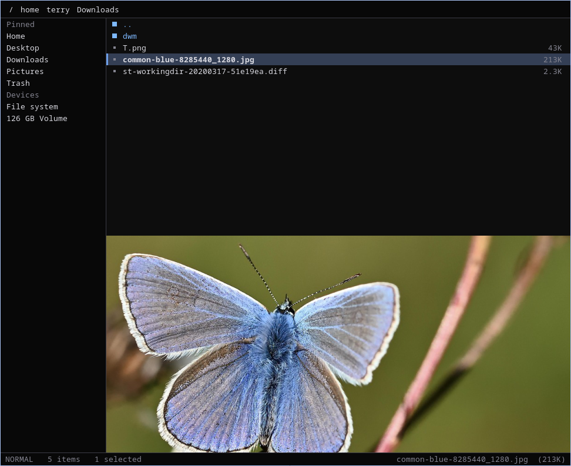
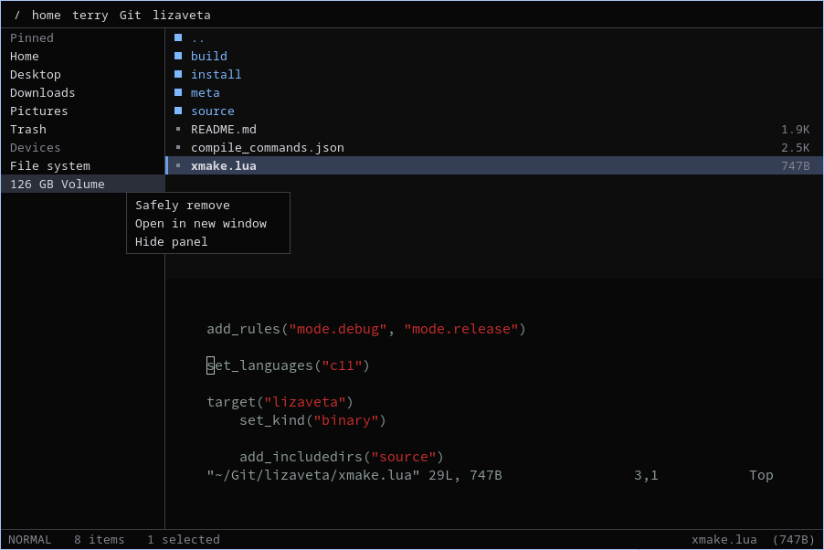

# Lizaveta

Graphical X11 file manager with VIM bindings, written in C. 

- Drag and drop support.
- Mounted device navigation.
- Macro support.
- Embedded preview processes.
     - Built-in image _feh_ & text _st+vim_ preview.
- Supports `--filechooser` protocol.
- DBUS integration out of the box.
- Minimal and launches very quickly.

## Screenshots
Image preview embedded in Lizaveta via `feh`. \
Runs as a seperate process, embedded using Xlib.

Text preview & device management
Text preview embedded in Lizaveta via `st` + `vim`. \
Runs as a seperate process, embedded using Xlib.

## Navigational keybindings

| Key | Action |
|----------|--------|
| `h` | Directory up |
| `l` | Enter directory |
| `j` | Cursor down |
| `k` | Cursor up |
| `n` | Next found item |
| `N` | Previous found item |
| `Shift` + `h` | Navigate to home directory |
| `Ctrl` + `d` | Scroll half page down |
| `Ctrl` + `u` | Scroll half page up |
| `Ctrl` + `o` | Jump history back |
| `Ctrl` + `i` | Jump history forward |

## Mode keybindings
| Key | Action |
|----------|--------|
| `v` | Visual mode |
| `:` | Command mode |
| `/` | Search mode |
| `Esc` | Normal  mode |
| `Shift` + `v` | Visual line mode |

## Filesystem keybindings

| Key | Action |
|----------|--------|
| `DEL` | Delete |
| `d` | Delete selection |
| `dd` | Delete at cursor |
| `r` | Rename |
| `o` | Create directory |

## Interface keybindings
| Key | Action |
|----------|--------|
| `p` | Preview file |
| `t` | Open current directory in terminal |
| `Ctrl` + `c` | Copy |
| `Ctrl` + `v` | Paste |
| `Ctrl` + `x` | Cut |
| `Ctrl` + `p` | Toggle side panel |
| `Ctrl` + `h` | Toggle hidden files |
| `Ctrl` + `l` | Focus on nav |
| `Ctrl` + `Enter` | Save as |
| `Shift` + `t` | Open directory at cursor in terminal |
| `Ctrl` + `Alt` + `d` | Quit |

## Commands
| Command | Action |
|----------|--------|
| `:noh` | Clear search highlight |
| `:q` | Quit |

---

__Why?__ I like Thunar, but it lacks Vim integration and feels sluggish. Pure terminal Vim file managers support neither drag-and-drop nor reliable image previews without specific terminal features. Few also integrate with D-Bus. With Lizaveta I want to address these common shortcomings, and great something *that just works*.
